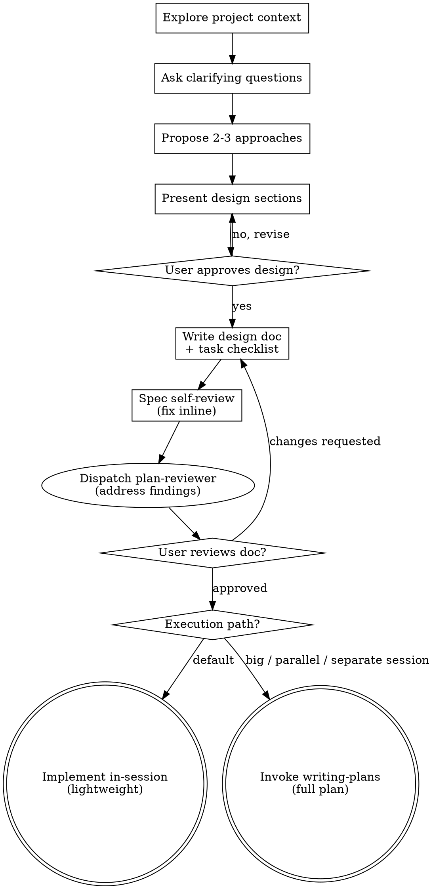

# Brainstorming Ideas Into Designs

Help turn ideas into fully formed designs and specs through natural collaborative dialogue.

Start by understanding the current project context, then ask questions one at a time to refine the idea. Once you understand what you're building, present the design and get user approval.

## When to skip the full workflow

Not every change needs the full dialogue — don't brainstorm every little thing. **Go straight to implementation when ALL of these hold:**

- The change is small and mechanical (a bug fix with a known cause, a config tweak, a rename, a contained edit to existing code).
- The requirements are already unambiguous — you could write the task list right now without asking a single clarifying question.
- There are no design decisions or trade-offs; there is one obvious correct approach.
- The blast radius is contained — no new component, interface, or dependency.

When all four hold, briefly state what you're about to do and do it (still using `superpowers:test-driven-development` for code changes). A one-line fix does not need a design doc.

**If ANY of them is in doubt, run the full workflow.** "This feels simple" is not the test — *genuinely well-defined and small* is. The next section is about exactly that trap.

<HARD-GATE>
For any change that is NOT a genuine skip per "When to skip the full workflow" above: do NOT invoke any implementation skill, write any code, scaffold any project, or take any implementation action until you have presented a design and the user has approved it. Perceived simplicity alone never qualifies for the skip.
</HARD-GATE>

## Anti-Pattern: "This Is Too Simple To Need A Design"

This is the failure mode the skip criteria guard against: assuming simplicity you haven't verified. A change that *feels* trivial but hides an unexamined assumption — a hidden interface, an ambiguous requirement, a "we'll just" — is where the most work gets wasted. If you're reaching for the skip because designing the work is tedious rather than because it's genuinely well-defined, that's the trap. When in doubt, present a short design (a few sentences) and get approval.

## Checklist

You MUST create a task for each of these items and complete them in order:

1. **Explore project context** — check files, docs, recent commits
2. **Offer the visual companion just-in-time** — NOT upfront. The first time a question would genuinely be clearer shown than described, offer it then (its own message); on approval its browser tab opens for you. If no visual question ever arises, never offer it. See the Visual Companion section below.
3. **Ask clarifying questions** — one at a time, understand purpose/constraints/success criteria
4. **Propose 2-3 approaches** — with trade-offs and your recommendation
5. **Present design** — in sections scaled to their complexity, get user approval after each section
6. **Write design doc + task checklist** — save to `docs/superpowers/<tkid>-<slug>/design_spec.md` (never commit — see "After the Design"); append the `## Implementation Tasks` checklist so the design doc *is* the plan
7. **Spec self-review** — quick inline check for placeholders, contradictions, ambiguity, scope (see below)
8. **Dispatch plan-reviewer** — dispatch the `plan-reviewer` subagent (template: [spec-document-reviewer-prompt.md](spec-document-reviewer-prompt.md)) with the doc path, reviewing the design *and* its task checklist; address every severity-classified finding before proceeding
9. **User reviews written doc** — ask the user to review the design doc + task checklist before proceeding
10. **Choose execution path** — offer the end-fork: Lightweight (implement in-session off the checklist) or Full plan (invoke writing-plans). See "End Fork" below

## Process Flow

**The terminal state is the execution fork.** Do NOT invoke frontend-design, mcp-builder, or any other implementation skill directly from brainstorming. The lightweight path implements in-session (invoking test-driven-development per task); the full-plan path hands off to writing-plans. Those are the only two exits.

## The Process

**Understanding the idea:**

- Check out the current project state first (files, docs, recent commits). **When the investigation is substantial** (large codebase, unfamiliar domain, many files to cross-reference), delegate to the `researcher` subagent instead of exploring inline — give it the research question, whether to look locally or externally, and your success criterion. This keeps your context clean for the design dialogue. For a quick check of a few files, explore inline.
- Before asking detailed questions, assess scope: if the request describes multiple independent subsystems (e.g., "build a platform with chat, file storage, billing, and analytics"), flag this immediately. Don't spend questions refining details of a project that needs to be decomposed first.
- If the project is too large for a single spec, help the user decompose into sub-projects: what are the independent pieces, how do they relate, what order should they be built? Then brainstorm the first sub-project through the normal design flow. Each sub-project gets its own spec → plan → implementation cycle.
- For appropriately-scoped projects, ask questions one at a time to refine the idea
- Prefer multiple choice questions when possible, but open-ended is fine too
- Only one question per message - if a topic needs more exploration, break it into multiple questions
- Focus on understanding: purpose, constraints, success criteria

**Exploring approaches:**

- Propose 2-3 different approaches with trade-offs
- Present options conversationally with your recommendation and reasoning
- Lead with your recommended option and explain why

**Presenting the design:**

- Once you believe you understand what you're building, present the design
- Scale each section to its complexity: a few sentences if straightforward, up to 200-300 words if nuanced
- Ask after each section whether it looks right so far
- Cover: architecture, components, data flow, error handling, testing
- Be ready to go back and clarify if something doesn't make sense

**Design for isolation and clarity:**

- Break the system into smaller units that each have one clear purpose, communicate through well-defined interfaces, and can be understood and tested independently
- For each unit, you should be able to answer: what does it do, how do you use it, and what does it depend on?
- Can someone understand what a unit does without reading its internals? Can you change the internals without breaking consumers? If not, the boundaries need work.
- Smaller, well-bounded units are also easier for you to work with - you reason better about code you can hold in context at once, and your edits are more reliable when files are focused. When a file grows large, that's often a signal that it's doing too much.

**Working in existing codebases:**

- Explore the current structure before proposing changes. Follow existing patterns.
- Where existing code has problems that affect the work (e.g., a file that's grown too large, unclear boundaries, tangled responsibilities), include targeted improvements as part of the design - the way a good developer improves code they're working in.
- Don't propose unrelated refactoring. Stay focused on what serves the current goal.

## After the Design

**Documentation:**

- Write the validated design (spec) to `docs/superpowers/<tkid>-<slug>/design_spec.md` (`<tkid>` = the ticket id, `<slug>` = a short kebab-case topic slug). See `herdle-tk-artifacts` for the naming and lifecycle convention.
  - (User preferences for spec location override this default)
- Use elements-of-style:writing-clearly-and-concisely skill if available
- **Never commit.** docs/superpowers artifacts are local working docs, not version control — never `git add` or `git commit` them. Any full plan (from writing-plans) goes in this same `<tkid>-<slug>` directory, next to this doc.

**Implementation Tasks (append to the design doc):**

The design doc ends with an `## Implementation Tasks` checklist — this is what makes the doc *the plan*, so a separate writing-plans pass isn't needed for the common case. Write the tasks **TDD-lite**: each task carries a title, the files it touches, what its test asserts (intent, not the code), and a one-line "done when". The implementing agent writes the real test and code live via `superpowers:test-driven-development` — do not spell out full code blocks or exact commands here.

Wrap the work in the fixed **Setup** (first) and **Code Review** + **Finalize** (last two) tasks per `herdle-tk-artifacts`. Follow that skill for the exact task contents and lifecycle stamping — don't restate them here.

**Spec Self-Review:**
After writing the spec document, look at it with fresh eyes:

1. **Placeholder scan:** Any "TBD", "TODO", incomplete sections, or vague requirements? Fix them.
2. **Internal consistency:** Do any sections contradict each other? Does the architecture match the feature descriptions?
3. **Scope check:** Is this focused enough for a single implementation plan, or does it need decomposition?
4. **Ambiguity check:** Could any requirement be interpreted two different ways? If so, pick one and make it explicit.

Fix any issues inline. No need to re-review — just fix and move on.

**Plan-reviewer dispatch:** After the inline self-review, dispatch the
`plan-reviewer` subagent with the spec path (template:
spec-document-reviewer-prompt.md). The inline check is a quick first pass; the
plan-reviewer is the thorough second pass. Address every severity-classified
finding before asking the user to review.

**User Review Gate:**
After the review loop passes, ask the user to review the written doc before proceeding:

> "Design doc + task checklist written to `<path>`. Please review it and let me know if you want to make any changes before we implement."

Wait for the user's response. If they request changes, make them and re-run the review loop. Only proceed once the user approves.

**End Fork:**

Once the user approves the doc, offer the two execution paths and let them choose:

> "Doc approved. Two ways to run it:
> **1. Lightweight (recommended)** — I implement in-session, task by task, straight off the checklist (TDD per task), then the baked Code Review and Finalize tasks close it out. No separate plan.
> **2. Full plan** — I hand off to writing-plans for a fully-specified `plan.md`, then subagent-driven-development. Better for a large feature, subagent-parallel execution, or handoff to a separate session.
> Which one?"

- **Lightweight** — implement in the current session. Invoke `superpowers:test-driven-development` per task; run the baked tasks (Setup → work → Code Review → Finalize) per `herdle-tk-artifacts`. Do NOT invoke writing-plans.
- **Full plan** — invoke the writing-plans skill. Do NOT invoke any other implementation skill directly.

Default to Lightweight when the user doesn't express a preference; reach for Full plan when the work is large, needs parallel subagents, or will be executed in a separate session.

## Key Principles

- **One question at a time** - Don't overwhelm with multiple questions
- **Multiple choice preferred** - Easier to answer than open-ended when possible
- **YAGNI ruthlessly** - Remove unnecessary features from all designs
- **Explore alternatives** - Always propose 2-3 approaches before settling
- **Incremental validation** - Present design, get approval before moving on
- **Be flexible** - Go back and clarify when something doesn't make sense

## Visual Companion

A browser-based companion for showing mockups, diagrams, and visual options during brainstorming. Available as a tool — not a mode. Accepting the companion means it's available for questions that benefit from visual treatment; it does NOT mean every question goes through the browser.

**Offering the companion (just-in-time):** Do NOT offer it upfront. Wait until a question would genuinely be clearer shown than told — a real mockup / layout / diagram question, not merely a UI *topic*. The first time that happens, offer it then, as its own message:
> "This next part might be easier if I show you — I can put together mockups, diagrams, and comparisons in a browser tab as we go. It's still new and can be token-intensive. Want me to? I'll open it for you."

**This offer MUST be its own message.** Only the offer — no clarifying question, summary, or other content. Wait for the user's response. If they accept, start the server with `--open` so their browser opens to the first screen automatically. If they decline, continue text-only and don't offer again unless they raise it.

**Per-question decision:** Even after the user accepts, decide FOR EACH QUESTION whether to use the browser or the terminal. The test: **would the user understand this better by seeing it than reading it?**

- **Use the browser** for content that IS visual — mockups, wireframes, layout comparisons, architecture diagrams, side-by-side visual designs
- **Use the terminal** for content that is text — requirements questions, conceptual choices, tradeoff lists, A/B/C/D text options, scope decisions

A question about a UI topic is not automatically a visual question. "What does personality mean in this context?" is a conceptual question — use the terminal. "Which wizard layout works better?" is a visual question — use the browser.

If they agree to the companion, read the detailed guide before proceeding:
`skills/brainstorming/visual-companion.md`
